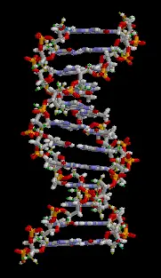

This is the test page for animation image files.

## animation GIF

> This work has been released into the public domain by its author, brian0918. This applies worldwide.  
> [File:DNA animation.gif](https://commons.wikimedia.org/wiki/File:DNA_animation.gif)

## Animation PNG

> This work has been released into the public domain by its author, Holger Will. This applies worldwide.  
> [File:3d2.png](https://commons.wikimedia.org/wiki/File:3d2.png)

## Animation WebP

convert by [GIF to WebP converter](https://ezgif.com/gif-to-webp/)

> This work has been released into the public domain by its author, brian0918. This applies worldwide.  
> [File:DNA animation.gif](https://commons.wikimedia.org/wiki/File:DNA_animation.gif)

## SVG

> This file is made available under the Creative Commons CC0 1.0 Universal Public Domain Dedication  
> [File:SVG Circle.svg](https://commons.wikimedia.org/wiki/File:SVG_Circle.svg)
