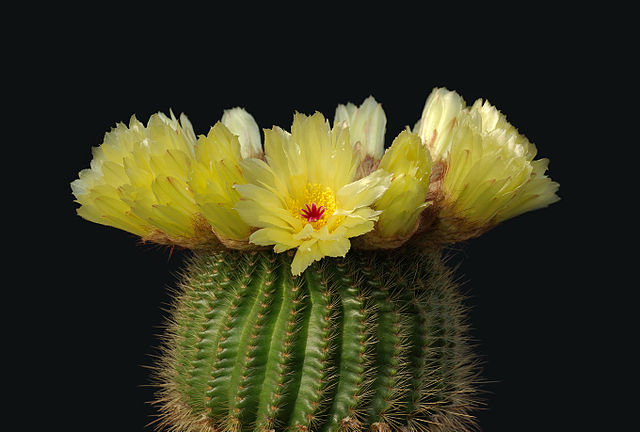
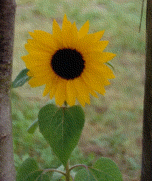

This is the test page for animation image files.

## JPEG

> This work has been released into the public domain by its author, Laitche. This applies worldwide.
> [File:Notocactus_minimus.jpg](https://commons.wikimedia.org/wiki/File:Notocactus_minimus.jpg)

## static GIF

> I, the copyright holder of this work, release this work into the public domain. This applies worldwide.
> [File:Sunflower_as_gif_websafe.gif](https://commons.wikimedia.org/wiki/File:Sunflower_as_gif_websafe.gif)

## animation GIF

> This work has been released into the public domain by its author, brian0918. This applies worldwide.  
> [File:DNA animation.gif](https://commons.wikimedia.org/wiki/File:DNA_animation.gif)

## static PNG

PNG transparency demonstration 24bit PNG with 8bit alpha layer

> This file is licensed under the Creative Commons Attribution-Share Alike 3.0 Unported license.  
> [File:PNG transparency demonstration 1.png](https://commons.wikimedia.org/wiki/File:PNG_transparency_demonstration_1.png)

## animation PNG

> This work has been released into the public domain by its author, Holger Will. This applies worldwide.  
> [File:3d2.png](https://commons.wikimedia.org/wiki/File:3d2.png)

## animation WebP

convert by [GIF to WebP converter](https://ezgif.com/gif-to-webp/)

> This work has been released into the public domain by its author, brian0918. This applies worldwide.  
> [File:DNA animation.gif](https://commons.wikimedia.org/wiki/File:DNA_animation.gif)

## SVG

> This file is made available under the Creative Commons CC0 1.0 Universal Public Domain Dedication  
> [File:SVG Circle.svg](https://commons.wikimedia.org/wiki/File:SVG_Circle.svg)

## Tif

Tiff files don't support in modern browser.

> This file is licensed under the Creative Commons Attribution-Share Alike 4.0 International license.
> [File:Tif.tif](https://commons.wikimedia.org/wiki/File:Tif.tif)